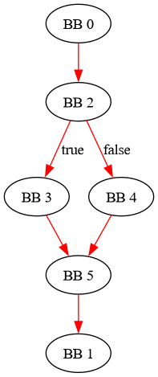
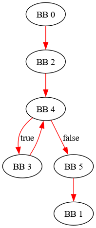

# TD2

## Q1

```bash
┌─[night@night-20b7s2ex01]─[~/gcc12]
└──╼ 6 fichiers, 24Kb)─$ find . -name "gcc-plugin.h"
./lib/gcc/x86_64-pc-linux-gnu/12.2.0/plugin/include/gcc-plugin.h
```

```bash
┌─[night@night-20b7s2ex01]─[~/gcc12]
└──╼ 6 fichiers, 24Kb)─$ cat ./lib/gcc/x86_64-pc-linux-gnu/12.2.0/plugin/include/gcc-plugin.h
/* Public header file for plugins to include.
   Copyright (C) 2009-2022 Free Software Foundation, Inc.

This file is part of GCC.

GCC is free software; you can redistribute it and/or modify
it under the terms of the GNU General Public License as published by
the Free Software Foundation; either version 3, or (at your option)
any later version.

GCC is distributed in the hope that it will be useful,
but WITHOUT ANY WARRANTY; without even the implied warranty of
MERCHANTABILITY or FITNESS FOR A PARTICULAR PURPOSE.  See the
GNU General Public License for more details.

You should have received a copy of the GNU General Public License
along with GCC; see the file COPYING3.  If not see
<http://www.gnu.org/licenses/>.  */

#ifndef GCC_PLUGIN_H
#define GCC_PLUGIN_H

#ifndef IN_GCC
#define IN_GCC
#endif

#include "config.h"
#include "system.h"
#include "coretypes.h"
#include "backend.h"
#include "cfghooks.h"
#include "hard-reg-set.h"
#include "cfgrtl.h"
#include "cfganal.h"
#include "lcm.h"
#include "cfgbuild.h"
#include "cfgcleanup.h"
#include "plugin-api.h"
#include "ipa-ref.h"
#include "alias.h"
#include "flags.h"
#include "tree-core.h"
#include "fold-const.h"
#include "tree-check.h"
#include "plugin.h"

#endif /* GCC_PLUGIN_H */
```

**exemple cours**

```bash
#include <gcc-plugin.h>

int plugin_is_GPL_compatible;

int plugin_init(struct plugin_name_args * plugin_info, struct plugin_gcc_version * version){
    printf( "Plugin initialization:\n" ) ;
    printf( "\tbasever = %s\n", version->basever ) ;
    printf( "\tdatestamp = %s\n", version->datestamp ) ;
    printf( "\tdevphase = %s\n", version->devphase ) ;
    printf( "\trevision = %s\n", version->revision ) ;
    printf( "\tconfig = %s\n", version->configuration_arguments ) ;
    return 0;
}
```

```bash
g++ -I`gcc -print-file-name=plugin`/include -g -Wall -fno-rtti -shared -fPIC -o libplugin.so plugin.cpp
```

```bash
gcc -fplugin=./libplugin.so -c test.c
```

En `makefile`:

```bash
EXE= TP2_1 \
	TP2_2 \
	TP2_3 \
	TP2_5 \
	TP2_6 \
	TP2_7 \
	TP2_7_bis \
	TP2_8 

all: $(EXE)

CXX=~/gcc12/bin/g++
CC=~/gcc12/bin/gcc

MPICC=mpicc

PLUGIN_FLAGS=-I`$(CC) -print-file-name=plugin`/include -g -Wall -fno-rtti -shared -fPIC

CFLAGS=-g -O3


libplugin_%.so: plugin_%.cpp
	$(CXX) $(PLUGIN_FLAGS) $(GMP_CFLAGS) -o $@ $<

% : libplugin_%.so test.c
	OMPICC_MPICC=$(CC) $(MPICC) test.c $(CFLAGS) -o $@ -fplugin=./$< 

clean:
	rm -rf $(EXE)

clean_all: clean
	rm -rf libplugin*.so *.dot
```

```bash
┌─[night@night-20b7s2ex01]─[~/S5/CA_2023/TDs/TD2/CODE]
└──╼ 7 fichiers, 128Kb)─$ make
~/gcc12/bin/g++ -I`~/gcc12/bin/gcc -print-file-name=plugin`/include -g -Wall -fno-rtti -shared -fPIC  -o libplugin_TP2_1.so plugin_TP2_1.cpp
OMPI_MPICC=~/gcc12/bin/gcc mpicc test.c -g -O3 -o TP2_1 -fplugin=./libplugin_TP2_1.so 
Plugin initialization:
        basever = 12.2.0
        datestamp = 20220819
        devphase = 
        revision = 
        config = ../configure --prefix=/home/night/gcc12 --enable-languages=c,c++ --enable-plugin --disable-bootstrap --disable-multilib
```

## Q2

```bash
┌─[night@night-20b7s2ex01]─[~/gcc12]
└──╼ 6 fichiers, 24Kb)─$ grep -r pass_data
grep: libexec/gcc/x86_64-pc-linux-gnu/12.2.0/cc1 : fichiers binaires correspondent
grep: libexec/gcc/x86_64-pc-linux-gnu/12.2.0/lto1 : fichiers binaires correspondent
grep: libexec/gcc/x86_64-pc-linux-gnu/12.2.0/cc1plus : fichiers binaires correspondent
lib/gcc/x86_64-pc-linux-gnu/12.2.0/plugin/include/tree-pass.h:struct pass_data
```

Voir `plugin_TP2_2.cpp`


```bash
┌─[✗]─[night@night-20b7s2ex01]─[~/S5/CA_2023/TDs/TD2/CODE]
└──╼ 9 fichiers, 152Kb)─$ make
~/gcc12/bin/g++ -I`~/gcc12/bin/gcc -print-file-name=plugin`/include -g -Wall -fno-rtti -shared -fPIC  -o libplugin_TP2_2.so plugin_TP2_2.cpp
Dans le fichier inclus depuis plugin_TP2_2.cpp:2:
/home/night/gcc12/lib/gcc/x86_64-pc-linux-gnu/12.2.0/plugin/include/plugin-version.h:16:34: attention: « gcc_version » défini mais pas utilisé [-Wunused-variable]
   16 | static struct plugin_gcc_version gcc_version = {basever, datestamp,
      |                                  ^~~~~~~~~~~
OMPI_MPICC=~/gcc12/bin/gcc mpicc test.c -g -O3 -o TP2_2 -fplugin=./libplugin_TP2_2.so 
Executing my_pass with function mpi_call
Executing my_pass with function main
```

`execute` est éxécutée pour mpi_call et main (parallèle)

## Q3

```bash
┌─[night@night-20b7s2ex01]─[~/gcc12]
└──╼ 6 fichiers, 24Kb)─$ find . -name "function.h"
./lib/gcc/x86_64-pc-linux-gnu/12.2.0/plugin/include/function.h
```

Dans `function.h`

```c++
/* Returns the name of the current function.  */
extern const char *fndecl_name (tree);
extern const char *function_name (struct function *);
```

On implémente

```c++
const char *print_func_name(function *fun){
    const char *fname = function_name(fun);
    printf("in function %s\n",fname);
}
```

Dans `class my_pass: public gimple_opt_pass`

```c++
bool gate (function *fun) {
        print_func_name(fun);
        return true;
}
```

(l'appel dans gate **ou** execute fonctionne)

gate appelée avant l'éxécution de la passe

```bash
make
```

```bash
OMPI_MPICC=~/gcc12/bin/gcc mpicc test.c -g -O3 -o TP2_3 -fplugin=./libplugin_TP2_3.so
in function mpi_call
Executing my_pass with function mpi_call
in function main
Executing my_pass with function main
```

## Q4

Toujours dans `function.h`

```c++
extern const char *current_function_name (void);

extern void used_types_insert (tree);

#endif  /* GCC_FUNCTION_H */
```

On rajoute dans notre plugin:

```c++
const char *print_func_name2(){
    const char *fname = current_function_name();
    printf("in function %s (appel current_function_name)\n",fname);
    return fname;
}
```

Dans gate ou execute:

```c++
bool gate (function *fun) {
    print_func_name(fun);
    print_func_name2();
    return true;
}
```

```bash
make
```

```bash
Executing my_pass with function mpi_call
Executing my_pass with function main
~/gcc12/bin/g++ -I`~/gcc12/bin/gcc -print-file-name=plugin`/include -g -Wall -fno-rtti -shared -fPIC  -o libplugin_TP2_3.so plugin_TP2_3.cpp
OMPI_MPICC=~/gcc12/bin/gcc mpicc test.c -g -O3 -o TP2_3 -fplugin=./libplugin_TP2_3.so 
in function mpi_call (appel function_name)
in function mpi_call (appel current_function_name)
Executing my_pass with function mpi_call
in function mpi_call (appel function_name)
in function main (appel function_name)
in function main (appel current_function_name)
Executing my_pass with function main
in function main (appel function_name)
```
## Q5

*CFG*

*Noeud -> basic block (BB)**

```bash
┌─[night@night-20b7s2ex01]─[~/gcc12]
└──╼ 6 fichiers, 24Kb)─$ grep  -r FOR_EACH_BB
share/info/gccint.info:       FOR_EACH_BB (bb)
share/info/gccint.info:for manipulating the CFG.  The macro ‘FOR_EACH_BB’ can be used to visit
share/info/gccint.info:     FOR_EACH_BB (bb)
grep: share/info/gccint.info : fichiers binaires correspondent
lib/gcc/x86_64-pc-linux-gnu/12.2.0/plugin/include/basic-block.h:#define FOR_EACH_BB_FN(BB, FN) \
lib/gcc/x86_64-pc-linux-gnu/12.2.0/plugin/include/basic-block.h:#define FOR_EACH_BB_REVERSE_FN(BB, FN) \
```

```c++
void print_blocs_index(function *fun){
    basic_block bb;
    gimple_stmt_iterator gsi;
    gimple *stmt;

    FOR_EACH_BB_FN(bb,fun){
        gsi = gsi_start_bb(bb);
        stmt = gsi_stmt(gsi);
        printf("Block index %d : line %d\n",bb->index,gimple_lineno(stmt));
    }
}
```

**dans le plugin**:

```c++
pass_info.reference_pass_name = "cfg";
pass_info.ref_pass_instance_number = 0;
pass_info.pos_op = PASS_POS_INSERT_AFTER;
```

```bash
OMPI_MPICC=~/gcc12/bin/gcc mpicc test.c -g -O3 -o TP2_5 -fplugin=./libplugin_TP2_5.so
Executing my_pass with function mpi_call
          |||++||| BLOCK INDEX 2
          |||++||| BLOCK INDEX 3
          |||++||| BLOCK INDEX 4
          |||++||| BLOCK INDEX 5
Executing my_pass with function main
          |||++||| BLOCK INDEX 2
          |||++||| BLOCK INDEX 3
          |||++||| BLOCK INDEX 4
          |||++||| BLOCK INDEX 5
```

## Q6

On éxécute:

```c++
void print_blocs_index(function *fun){
    basic_block bb;
    gimple_stmt_iterator gsi;
    gimple *stmt;

    FOR_EACH_BB_FN(bb,fun){
        gsi = gsi_start_bb(bb);
        stmt = gsi_stmt(gsi);
        printf("          |||++||| BLOCK INDEX %d\n: LINE %d\n", bb->index,gimple_lineno(stmt));
        //td2_q8_print_called_functions(bb);

	}
}
```

```bash
OMPI_MPICC=~/gcc12/bin/gcc mpicc test.c -g -O3 -o TP2_6 -fplugin=./libplugin_TP2_6.so
Executing my_pass with function mpi_call
          |||++||| BLOCK INDEX 2
: LINE 8
          |||++||| BLOCK INDEX 3
: LINE 12
          |||++||| BLOCK INDEX 4
: LINE 16
          |||++||| BLOCK INDEX 5
: LINE 18
Executing my_pass with function main
          |||++||| BLOCK INDEX 2
: LINE 23
          |||++||| BLOCK INDEX 3
: LINE 33
          |||++||| BLOCK INDEX 4
: LINE 30
          |||++||| BLOCK INDEX 5
: LINE 37
```

Avec la macro `FOR_ALL_BB_FN`

```bash
~/gcc12/bin/g++ -I`~/gcc12/bin/gcc -print-file-name=plugin`/include -g -Wall -fno-rtti -shared -fPIC  -o libplugin_TP2_6.so plugin_TP2_6.cpp
OMPI_MPICC=~/gcc12/bin/gcc mpicc test.c -g -O3 -o TP2_6 -fplugin=./libplugin_TP2_6.so
Executing my_pass with function mpi_call
durant l'étape GIMPLE: NEW_PASS
test.c: Dans la fonction « mpi_call »:
test.c:6:6: erreur interne du compilateur: Erreur de segmentation
    6 | void mpi_call(int c)
      |      ^~~~~~~~
0xc19fdf crash_signal
        ../../gcc/toplev.cc:322
0x7f62d5bc023c gimple_location
        /home/night/gcc12/lib/gcc/x86_64-pc-linux-gnu/12.2.0/plugin/include/gimple.h:1899
0x7f62d5bc0258 gimple_lineno
        /home/night/gcc12/lib/gcc/x86_64-pc-linux-gnu/12.2.0/plugin/include/gimple.h:1967
0x7f62d5bc034e print_blocs_index(function*)
        /home/night/S5/CA_2023/TDs/TD2/CODE/plugin_TP2_6.cpp:18
0x7f62d5bc0622 my_pass::execute(function*)
        /home/night/S5/CA_2023/TDs/TD2/CODE/plugin_TP2_6.cpp:49
Veuillez soumettre un rapport d’anomalies complet, avec la sortie du préprocesseur (en utilisant -freport-bug).
Veuillez inclure la trace de débogage complète dans tout rapport d'anomalie.
Voir <https://gcc.gnu.org/bugs/> pour les instructions.
```

## Q7

```bash
~/gcc12/bin/g++ -I`~/gcc12/bin/gcc -print-file-name=plugin`/include -g -Wall -fno-rtti -shared -fPIC  -o libplugin_TP2_7.so plugin_TP2_7.cpp
Dans le fichier inclus depuis plugin_TP2_7.cpp:2:
/home/night/gcc12/lib/gcc/x86_64-pc-linux-gnu/12.2.0/plugin/include/plugin-version.h:16:34: attention: « gcc_version » défini mais pas utilisé [-Wunused-variable]
   16 | static struct plugin_gcc_version gcc_version = {basever, datestamp,
      |                                  ^~~~~~~~~~~
OMPI_MPICC=~/gcc12/bin/gcc mpicc test.c -g -O3 -o TP2_7 -fplugin=./libplugin_TP2_7.so
Executing my_pass with function mpi_call
[GRAPHVIZ] Generating CFG of function mpi_call in file <mpi_call_test.c_7_viz.dot>
Executing my_pass with function main
[GRAPHVIZ] Generating CFG of function main in file <main_test.c_22_viz.dot>
```





## Q8

```bash
~/gcc12/bin/g++ -I`~/gcc12/bin/gcc -print-file-name=plugin`/include -g -Wall -fno-rtti -shared -fPIC  -o libplugin_TP2_8.so plugin_TP2_8.cpp
Dans le fichier inclus depuis plugin_TP2_8.cpp:2:
/home/night/gcc12/lib/gcc/x86_64-pc-linux-gnu/12.2.0/plugin/include/plugin-version.h:16:34: attention: « gcc_version » défini mais pas utilisé [-Wunused-variable]
   16 | static struct plugin_gcc_version gcc_version = {basever, datestamp,
      |                                  ^~~~~~~~~~~
OMPI_MPICC=~/gcc12/bin/gcc mpicc test.c -g -O3 -o TP2_8 -fplugin=./libplugin_TP2_8.so
Executing my_pass with function mpi_call
        |||++|| BLOCK INDEX 2 : LINE 8
        |||++||| - gimple statement is a function call: "MPI_Barrier"
        |||++|| BLOCK INDEX 3 : LINE 12
        |||++||| - gimple statement is a function call: "printf"
        |||++|| BLOCK INDEX 4 : LINE 16
        |||++||| - gimple statement is a function call: "printf"
        |||++|| BLOCK INDEX 5 : LINE 18
Executing my_pass with function main
        |||++|| BLOCK INDEX 2 : LINE 23
        |||++||| - gimple statement is a function call: "MPI_Init"
        |||++|| BLOCK INDEX 3 : LINE 33
        |||++||| - gimple statement is a function call: "mpi_call"
        |||++|| BLOCK INDEX 4 : LINE 30
        |||++|| BLOCK INDEX 5 : LINE 37
        |||++||| - gimple statement is a function call: "printf"
        |||++||| - gimple statement is a function call: "MPI_Finalize"
rm libplugin_TP2_7.so libplugin_TP2_8.so libplugin_TP2_2.so libplugin_TP2_6.so libplugin_TP2_3.so libplugin_TP2_5.so libplugin_TP2_1.so
```
