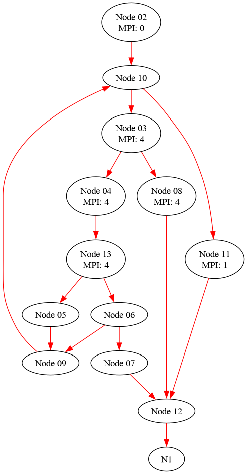

## TD4

## Q1 

SRC = {0}
PUITS = {12}

**X >> Y <-> X DOM Y (X apparaît sur tous les chemins de SRC->Y)** (SRC->X->Y)

i.e (*X est le seul à être au-dessus (origine d'un chemin vers) de Y*)
i.e (passer par X => passer par Y plus haut)

```
0 >> *
1 >> {}
2 >> * \ {0}
3 >> {8,4,13,6,5,9,7}
4 >> {13,6,5,7,9}
5 >> {}
6 >> {7}
7 >> {}
8 >> {}
9 >> {}
10 >> * \ {0,2}
11 >> {}
12 >> {1}
13 >> {5,6,7,9}
```

## Q2

**X >>p Y <-> X PDOM Y (X apparaît sur tous les chemins de Y->SINK)** (Y->X->SINK)

i.e (*X est un passage obligé en dessous (destination d'un chemin depuis) de Y*)
i.e (passer par Y => passer par X plus haut)
i.e (X tels que tous ses parents n'ont qu'une seule arête / choix -> X)
i.e (dominance dans le graphe inverse)

```
0 >>p {}
1 >>p *
2 >> {0}
3 >>p {}
4 >>p {}
5 >>p {}
6 >>p {}
7 >>p {}
8 >>p {}
9 >>p {5}
10 >>p {0,2,5,9}
11 >>p {}
12 >>p * \ {1}
13 >>p {4}
```

## Q3

**Frontière dominance**

*premier noeuds qui ne sont pas dans le cycle de dominance?*

- 0: -
- 1: -
- 2: -
- 3: 12, 10
- 4: 12, 10
- 5: 9
- 6: 1, 12
- 7: 12
- 8: 12
- 9: 10
- 10: 10
- 11: 12
- 12: -
- 13: 12, 10

```
0:
1: 6
2:
3:
4:
5:
6:
7:
8:
9: 5
10: 3,4,9,10,13
11:
12: 3,4,6,7,8,11,13
13: 

```

## Q4

**Frontière post-dominance**

Pour chaque noeud v, donner l'ensemble des noeuds n'étant pas post-dominés
strictement par ce noeud v mais dont v post-domine un successeur (frontière de
post-dominance).

PDF(Y) = { X | Il existe Sx dans succs(X) tel que (Y >>p Sx) et ( Y !>> p X) } 

- 0: -
- 1: -
- 2: -
- 3: 10
- 4: 3
- 5: 13
- 6: 13
- 7: 6
- 8: 3
- 9: 6, 13
- 10: 6, 13
- 11: 10
- 12: -
- 13: 3


## Q5

```bash
┌─[night@night-20b7s2ex01]─[~/gcc12]
└──╼ 6 fichiers, 24Kb)─$ find . -name "dominance.h"
./lib/gcc/x86_64-pc-linux-gnu/12.2.0/plugin/include/dominance.h
```

```c++
enum cdi_direction
{
  CDI_DOMINATORS = 1,
  CDI_POST_DOMINATORS = 2
};

/* State of dominance information.  */

enum dom_state
{
  DOM_NONE,		/* Not computed at all.  */
  DOM_NO_FAST_QUERY,	/* The data is OK, but the fast query data are not usable.  */
  DOM_OK		/* Everything is ok.  */
};

extern void calculate_dominance_info (enum cdi_direction);
extern void calculate_dominance_info_for_region (enum cdi_direction,
						 vec<basic_block>);
extern void free_dominance_info (function *, enum cdi_direction);
extern void free_dominance_info (enum cdi_direction);
extern void free_dominance_info_for_region (function *,
					    enum cdi_direction,
					    vec<basic_block>);
...
/* cast vec en auto_vec */
extern auto_vec<basic_block> get_all_dominated_blocks (enum cdi_direction,
						       basic_block);
```

On retrouve la question 1 (on considère le noeud lui même): même dominance + **"les noeuds étudiés sont comptés eux-mêmes"**

```bash
~/gcc12/bin/g++ -I`~/gcc12/bin/gcc -print-file-name=plugin`/include -g -Wall -fno-rtti -shared -fPIC  -o libplugin_TP4_5.so plugin_TP4_5.cpp
OMPI_MPICC=~/gcc12/bin/gcc mpicc test3.c -g -O3 -o TP4_5 -fplugin=./libplugin_TP4_5.so
Function: 'main'
        BB 02
                >> 02
                >> 10
                >> 12
                >> 11
                >> 03
                >> 08
                >> 04
                >> 09
                >> 06
                >> 05
                >> 07
        BB 03
                >> 03
                >> 08
                >> 04
                >> 09
                >> 06
                >> 05
                >> 07
        BB 04
                >> 04
                >> 09
                >> 06
                >> 05
                >> 07
        BB 05
                >> 05
        BB 06
                >> 06
                >> 07
        BB 07
                >> 07
        BB 08
                >> 08
        BB 09
                >> 09
        BB 10
                >> 10
                >> 12
                >> 11
                >> 03
                >> 08
                >> 04
                >> 09
                >> 06
                >> 05
                >> 07
        BB 11
                >> 11
        BB 12
                >> 12
[GRAPHVIZ] Generating CFG of function main in file <main_test3.c_8_main.dot>
```



## Q6

On modifie dans `FOR_EACH_BB_FN`:

```c++
printf("\tBB %02d\n", bb->index);
auto_vec<basic_block> dominated = get_all_dominated_blocks(CDI_DOMINATORS, bb);
for (unsigned int i = 0; i < dominated.length(); i++) {
        if (bb->index != dominated[i]->index){
                printf("\t\t>> %02d\n", dominated[i]->index);
        }
}
```

```bash
[GRAPHVIZ] Generating CFG of function main in file <main_test3.c_8_main_q5.dot>
~/gcc12/bin/g++ -I`~/gcc12/bin/gcc -print-file-name=plugin`/include -g -Wall -fno-rtti -shared -fPIC  -o libplugin_TP4_6.so plugin_TP4_6.cpp
OMPI_MPICC=~/gcc12/bin/gcc mpicc test3.c -g -O3 -o TP4_6 -fplugin=./libplugin_TP4_6.so
Function: 'main'
        MPI COLLECTIVE: 'MPI_Init' (code: 0)
        BB 02
                >> 10
                >> 12
                >> 11
                >> 03
                >> 08
                >> 04
                >> 09
                >> 06
                >> 05
                >> 07
        MPI COLLECTIVE: 'MPI_Barrier' (code: 4)
        BB 03
                >> 08
                >> 04
                >> 09
                >> 06
                >> 05
                >> 07
        Split the block 04
        MPI COLLECTIVE: 'MPI_Barrier' (code: 4)
        BB 04
                >> 13
                >> 05
                >> 06
                >> 09
                >> 07
        MPI COLLECTIVE: 'MPI_Barrier' (code: 4)
        BB 13
                >> 05
                >> 06
                >> 09
                >> 07
        BB 05
        BB 06
                >> 07
        BB 07
        MPI COLLECTIVE: 'MPI_Barrier' (code: 4)
        BB 08
        BB 09
        BB 10
                >> 12
                >> 11
                >> 03
                >> 08
                >> 04
                >> 13
                >> 05
                >> 06
                >> 09
                >> 07
        MPI COLLECTIVE: 'MPI_Finalize' (code: 1)
        BB 11
        BB 12
```

## Q7

a)

On retrouve le résultat de la question2: même post-dominance + **"les noeuds étudiés sont comptés eux-mêmes"**


```c++
[GRAPHVIZ] Generating CFG of function main in file <main_test3.c_8_main.dot>
~/gcc12/bin/g++ -I`~/gcc12/bin/gcc -print-file-name=plugin`/include -g -Wall -fno-rtti -shared -fPIC  -o libplugin_TP4_7.so plugin_TP4_7.cpp
OMPI_MPICC=~/gcc12/bin/gcc mpicc test3.c -g -O3 -o TP4_7 -fplugin=./libplugin_TP4_7.so
Function: 'main'
        MPI COLLECTIVE: 'MPI_Init' (code: 0)
        BB 02
        MPI COLLECTIVE: 'MPI_Barrier' (code: 4)
        BB 03
        Split the block 04
        MPI COLLECTIVE: 'MPI_Barrier' (code: 4)
        BB 04
        MPI COLLECTIVE: 'MPI_Barrier' (code: 4)
        BB 13
        BB 05
        BB 06
        BB 07
        MPI COLLECTIVE: 'MPI_Barrier' (code: 4)
        BB 08
        BB 09
                >> 05
        BB 10
                >> 09
                >> 02
                >> 05
        MPI COLLECTIVE: 'MPI_Finalize' (code: 1)
        BB 11
        BB 12
                >> 11
                >> 10
                >> 08
                >> 07
                >> 06
                >> 04
                >> 03
                >> 09
                >> 02
                >> 05
[GRAPHVIZ] Generating CFG of function main in file <main_test3.c_8_main_q7.dot>
rm libplugin_TP4_6.so libplugin_TP4_5.so libplugin_TP4_7.so
```
