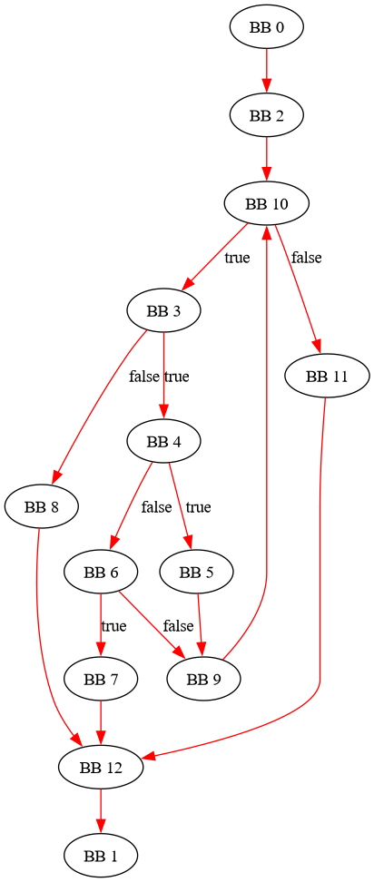
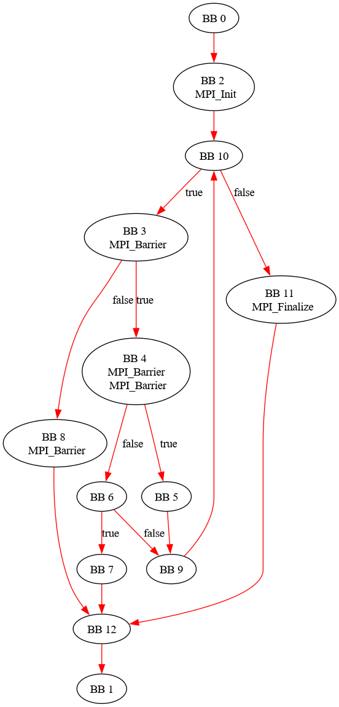
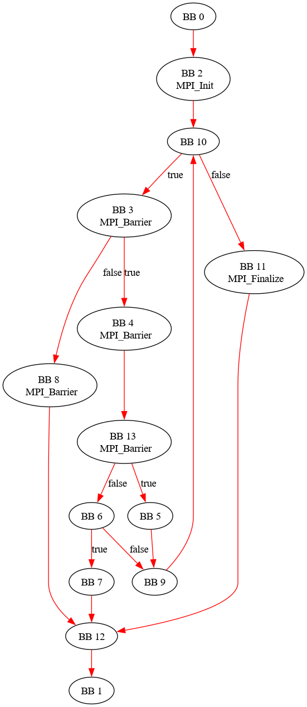

## Rappel - jusqu'au TD4

`plugin_TP5_0.cpp`







## Q1

(Chercher dans les sources **et pas dans l'installation** ...)

```bash
┌─[night@night-20b7s2ex01]─[~/S5/gcc-12.2.0]
└──╼ 79 fichiers, 15Mb)─$ find . -name "bitmap.h"
./gcc/bitmap.h
```

`bitmap.h`

```c
/*
Often the most suitable representation during construction of the set
is not the best choice for the usage of the set.  For such cases, the
"view" of the set can be changed from one representation to the other.
This is an O(E) operation:

     * from list to tree view	: bitmap_tree_view
     * from tree to list view	: bitmap_list_view

*/
static inline void
bitmap_initialize (bitmap head, bitmap_obstack *obstack CXX_MEM_STAT_INFO)
{
  head->first = head->current = NULL;
  head->indx = head->tree_form = 0;
  head->padding = 0;
  head->alloc_descriptor = 0;
  head->obstack = obstack;
  if (GATHER_STATISTICS)
    bitmap_register (head PASS_MEM_STAT);
}
```

Comme indiqué dans l'énoncé on recherche `df_md_local_compute` car l'algo calculant la frontière de post dominance avec les bitmaps est dedans:

```bash
┌─[night@night-20b7s2ex01]─[~/S5/gcc-12.2.0]
└──╼ 79 fichiers, 15Mb)─$ grep -r df_md_local_compute
gcc/ChangeLog-2018:     (df_md_local_compute): Likewise.
gcc/ChangeLog-2010:     * df-problems.c (df_md_local_compute): Likewise.
gcc/ChangeLog-2010:     df_md_bb_local_compute_process_def, df_md_local_compute,
gcc/ChangeLog-2010:     df_md_bb_local_compute_process_def, df_md_local_compute, df_md_reset,
gcc/ChangeLog-2013:     df_live_verify_solution_start, df_md_local_compute): Likewise.
gcc/ChangeLog-2013:     df_md_bb_local_compute, df_md_local_compute,
gcc/ChangeLog-2009:     (df_md_local_compute): Only include live registers in init.
gcc/ChangeLog-2009:     (df_md_local_compute): Only include live registers in init.
gcc/ChangeLog-2009:     (df_rd_local_compute, df_md_local_compute): Inline them.
gcc/ChangeLog-2009:     (df_md_local_compute): Only include live registers in init.
gcc/ChangeLog-2009:     df_md_bb_local_compute, df_md_local_compute, df_md_reset,
gcc/df-problems.cc:df_md_local_compute (bitmap all_blocks)
gcc/df-problems.cc:  df_md_local_compute,        /* Local compute function.  */
grep: build/gcc/cc1 : fichiers binaires correspondent
grep: build/gcc/lto-dump : fichiers binaires correspondent
grep: build/gcc/df-problems.o : fichiers binaires correspondent
grep: build/gcc/lto1 : fichiers binaires correspondent
grep: build/gcc/cc1plus : fichiers binaires correspondent
```

L'algorithme est effecuté dans `compute_dominance_frontiers`: il faut modifier pour la **post_dominance**:

```c
static void
df_md_local_compute (bitmap all_blocks)
{
  unsigned int bb_index, df_bb_index;
  bitmap_iterator bi1, bi2;
  basic_block bb;
  bitmap_head *frontiers;

  bitmap_initialize (&seen_in_insn, &bitmap_default_obstack);

  EXECUTE_IF_SET_IN_BITMAP (all_blocks, 0, bb_index, bi1)
    {
      df_md_bb_local_compute (bb_index);
    }

  bitmap_release (&seen_in_insn);

  frontiers = XNEWVEC (bitmap_head, last_basic_block_for_fn (cfun));
  FOR_ALL_BB_FN (bb, cfun)
    bitmap_initialize (&frontiers[bb->index], &bitmap_default_obstack);

  compute_dominance_frontiers (frontiers);

  /* Add each basic block's kills to the nodes in the frontier of the BB.  */
  EXECUTE_IF_SET_IN_BITMAP (all_blocks, 0, bb_index, bi1)
    {
      bitmap kill = &df_md_get_bb_info (bb_index)->kill;
      EXECUTE_IF_SET_IN_BITMAP (&frontiers[bb_index], 0, df_bb_index, bi2)
	{
	  basic_block bb = BASIC_BLOCK_FOR_FN (cfun, df_bb_index);
	  if (bitmap_bit_p (all_blocks, df_bb_index))
	    bitmap_ior_and_into (&df_md_get_bb_info (df_bb_index)->init, kill,
				 df_get_live_in (bb));
	}
    }

  FOR_ALL_BB_FN (bb, cfun)
    bitmap_clear (&frontiers[bb->index]);
  free (frontiers);
}
```

Donc on recherche cette fonction:

```bash
┌─[✗]─[night@night-20b7s2ex01]─[~/S5/gcc-12.2.0]
└──╼ 79 fichiers, 15Mb)─$ grep -r compute_dominance_frontiers
gcc/ChangeLog-2004:     * cfganal.c (compute_dominance_frontiers_1): Likewise.
gcc/ChangeLog-2004:     (compute_dominance_frontiers_1): Likewise.
gcc/ChangeLog-2004:     * cfganal.c (compute_dominance_frontiers_1) Ditto.
gcc/ChangeLog-2004:     * tree-flow.h (compute_dominance_frontiers): Move prototype...
gcc/ChangeLog-2004:     * tree-cfg.c (compute_dominance_frontiers_1,
gcc/ChangeLog-2004:     compute_dominance_frontiers): Move from here...
gcc/cfganal.cc:compute_dominance_frontiers (bitmap_head *frontiers)
gcc/cfganal.cc:   frontier information as returned by compute_dominance_frontiers.
```

`cfganal.cc`

Donc il faut modifier dans ce **parcours en profondeur** ce qui marchait pour la dominance -> frontière post dominance

```c
namespace {
/* Store the data structures necessary for depth-first search.  */
class depth_first_search
  {
public:
    depth_first_search ();

    basic_block execute (basic_block);
    void add_bb (basic_block);

private:
  /* stack for backtracking during the algorithm */
  auto_vec<basic_block, 20> m_stack;

  /* record of basic blocks already seen by depth-first search */
  auto_sbitmap m_visited_blocks;
};
}

/* Mark the back edges in DFS traversal.
   Return nonzero if a loop (natural or otherwise) is present.
   Inspired by Depth_First_Search_PP described in:

     Advanced Compiler Design and Implementation
     Steven Muchnick
     Morgan Kaufmann, 1997

   and heavily borrowed from pre_and_rev_post_order_compute.  */

bool
mark_dfs_back_edges (struct function *fun)
{
  int *pre;
  int *post;
  int prenum = 1;
  int postnum = 1;
  bool found = false;

  /* Allocate the preorder and postorder number arrays.  */
  pre = XCNEWVEC (int, last_basic_block_for_fn (fun));
  post = XCNEWVEC (int, last_basic_block_for_fn (fun));

  /* Allocate stack for back-tracking up CFG.  */
  auto_vec<edge_iterator, 20> stack (n_basic_blocks_for_fn (fun) + 1);

  /* Allocate bitmap to track nodes that have been visited.  */
  auto_sbitmap visited (last_basic_block_for_fn (fun));

  /* None of the nodes in the CFG have been visited yet.  */
  bitmap_clear (visited);

  /* Push the first edge on to the stack.  */
  stack.quick_push (ei_start (ENTRY_BLOCK_PTR_FOR_FN (fun)->succs));

  while (!stack.is_empty ())
    {
      basic_block src;
      basic_block dest;

      /* Look at the edge on the top of the stack.  */
      edge_iterator ei = stack.last ();
      src = ei_edge (ei)->src;
      dest = ei_edge (ei)->dest;
      ei_edge (ei)->flags &= ~EDGE_DFS_BACK;

      /* Check if the edge destination has been visited yet.  */
      if (dest != EXIT_BLOCK_PTR_FOR_FN (fun) && ! bitmap_bit_p (visited,
								 dest->index))
	{
	  /* Mark that we have visited the destination.  */
	  bitmap_set_bit (visited, dest->index);

	  pre[dest->index] = prenum++;
	  if (EDGE_COUNT (dest->succs) > 0)
	    {
	      /* Since the DEST node has been visited for the first
		 time, check its successors.  */
	      stack.quick_push (ei_start (dest->succs));
	    }
	  else
	    post[dest->index] = postnum++;
	}
      else
	{
	  if (dest != EXIT_BLOCK_PTR_FOR_FN (fun)
	      && src != ENTRY_BLOCK_PTR_FOR_FN (fun)
	      && pre[src->index] >= pre[dest->index]
	      && post[dest->index] == 0)
	    ei_edge (ei)->flags |= EDGE_DFS_BACK, found = true;

	  if (ei_one_before_end_p (ei)
	      && src != ENTRY_BLOCK_PTR_FOR_FN (fun))
	    post[src->index] = postnum++;

	  if (!ei_one_before_end_p (ei))
	    ei_next (&stack.last ());
	  else
	    stack.pop ();
	}
    }

  free (pre);
  free (post);

  return found;
}
```
